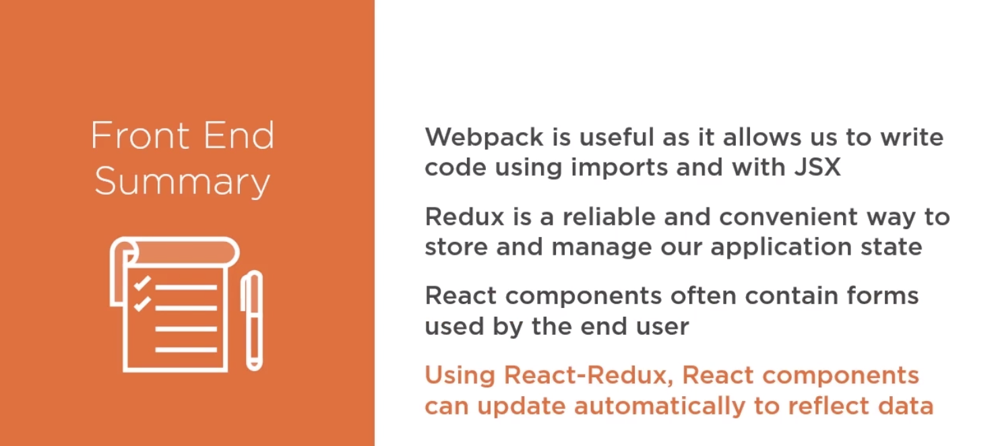
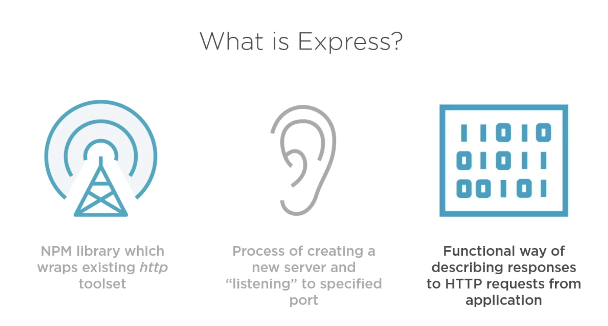

## React + Redux + Webpack + Babel + Express 

[Pluralsight Course](https://app.pluralsight.com/library/courses/react-express-full-stack-app-building/table-of-contents)

### Starting application with webpack

`npm install`

`npm run start-dev` starts both server and frontend 

### Frontend 

*Webpack, Babel, React, Redux*

### Server

*Express* 

### Next Steps  

- [ ] [Containerize App using Paketo Buildpacks](https://link.medium.com/uAgsc9IMR5)

### Bugs

- [x] `WARNING in ./src/app/store/sagas.js 52:6-13 "export 'default' (imported as'history') was not found in './history' @ ./src/app/store/index.js @ ./src/app/index.jsx`
